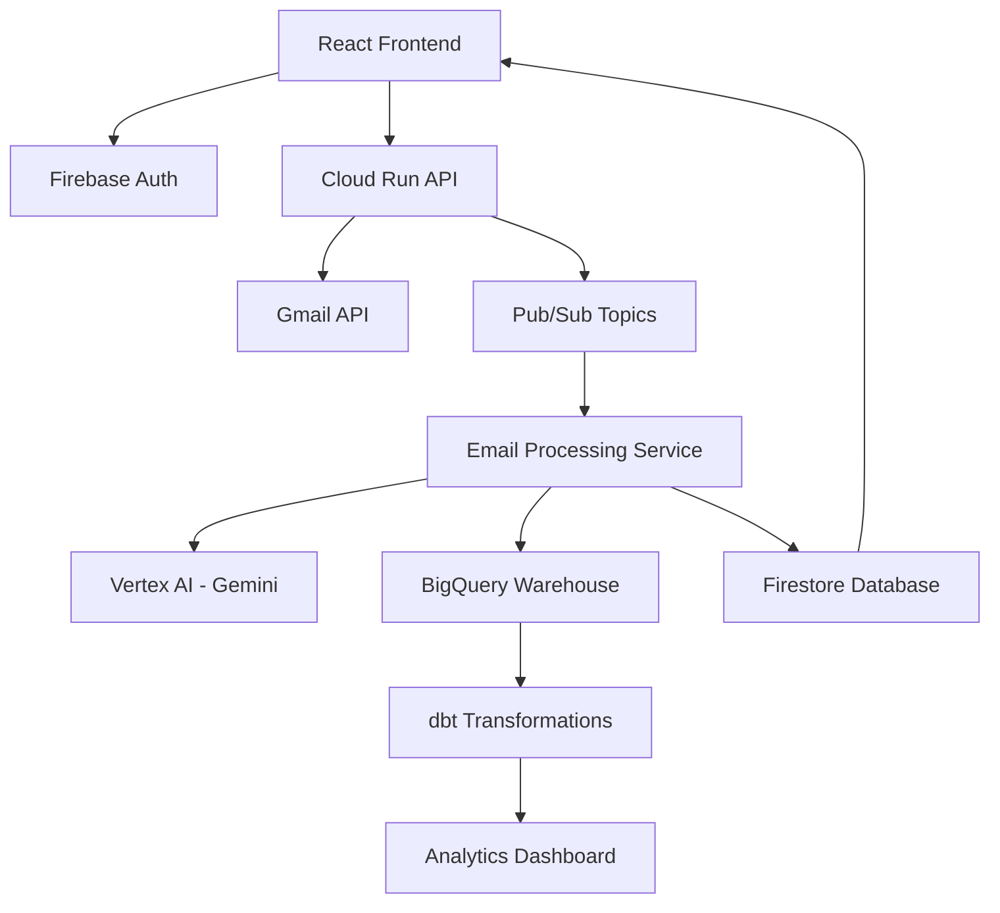

# OnlyJobs - AI-Powered Job Application Tracker

> An intelligent job application tracking system that automatically syncs with Gmail, uses AI to classify and extract job application details, and provides real-time analytics through a modern web dashboard.

[](https://cloud.google.com/)
[](https://reactjs.org/)
[](https://www.typescriptlang.org/)
[](https://www.python.org/)
[](https://cloud.google.com/vertex-ai)

## ✨ Features

- **🔐 Secure Authentication** - Firebase Auth with email verification and OAuth integration
- **📧 Gmail Integration** - Automatic email fetching and intelligent job application detection
- **🤖 AI-Powered Classification** - Google Vertex AI (Gemini 2.5 Flash) for intelligent email analysis
- **📊 Real-time Analytics** - Live dashboard with interactive charts and metrics
- **⚡ Cloud-Native Architecture** - Fully deployed on Google Cloud Platform with auto-scaling
- **🔄 Event-Driven Processing** - Pub/Sub for scalable, asynchronous email processing
- **📱 Modern UI** - Responsive React application with Material-UI design system

## 🏗️ Architecture

OnlyJobs is built with a cloud-native, event-driven architecture for maximum scalability and reliability:



## 🚀 Quick Start

### Prerequisites

- **Node.js** 18+ and npm
- **Python** 3.9+ and pip
- **Google Cloud Platform** account with billing enabled
- **Firebase** project configured
- **Gmail API** access enabled

### 1. Clone and Setup

```bash
# Clone the repository
git clone <repository-url>
cd onlyjobs

# Install frontend dependencies
cd frontend
npm install

# Install backend dependencies
cd ../backend
pip install -r requirements.txt
```

### 2. Environment Configuration

Create environment files:

**Frontend** (`.env.local`):
```env
REACT_APP_FIREBASE_API_KEY=your_firebase_api_key
REACT_APP_FIREBASE_AUTH_DOMAIN=your_project.firebaseapp.com
REACT_APP_FIREBASE_PROJECT_ID=your_project_id
REACT_APP_API_BASE_URL=https://your-api-endpoint.run.app
```

**Backend** - Configure in Google Cloud Console:
```env
PROJECT_ID=your-gcp-project-id
LOCATION=us-central1
BQ_DATASET_ID=user_data
BQ_RAW_TABLE_ID=job_applications
FIRESTORE_DATABASE_ID=emails-firestore
```

### 3. Local Development

```bash
# Start frontend development server
cd frontend
npm start

# The app will be available at http://localhost:3000
```

### 4. Deploy to Google Cloud

Use the deployment notebook for automated setup:

```bash
# Open deployment orchestration
jupyter notebook deployments.ipynb
```

Or deploy manually:

```bash
# Deploy Cloud Run services
gcloud run deploy process-emails --source backend/services/process_emails
gcloud run deploy manage-tokens --source backend/functions/manage_tokens
gcloud run deploy gmail-fetch --source backend/functions/gmail_fetch

# Deploy frontend to Firebase Hosting
cd frontend
npm run build
firebase deploy
```

## 🛠️ Tech Stack

### Frontend
- **React 19** with TypeScript for type-safe development
- **Material-UI v7** for consistent design system
- **Firebase Auth** for secure authentication
- **Recharts** for data visualization
- **React Router v7** for client-side routing

### Backend
- **Google Cloud Run** for serverless container deployment
- **Python Flask** for API services
- **Google Vertex AI** (Gemini 2.5 Flash) for AI-powered email analysis
- **Google Pub/Sub** for event-driven architecture
- **BigQuery** for data warehousing and analytics
- **Firestore** for real-time database operations

### Infrastructure
- **Google Cloud Platform** for all cloud services
- **Docker** for containerization
- **dbt** for data transformations
- **Firebase Hosting** for frontend deployment

## 🤖 AI Email Processing

The system intelligently processes job-related emails using advanced AI:

### Classification Process
1. **Email Ingestion** - Automatic Gmail API synchronization
2. **AI Analysis** - Vertex AI classifies emails as job-related
3. **Data Extraction** - Structured data extraction:
   - Company name and job title
   - Application status (Applied, Interviewed, Declined, Offer)
   - Location and salary information
   - Important dates and deadlines
4. **Storage** - Dual storage in BigQuery (analytics) and Firestore (real-time)

### Processing Pipeline
```
Gmail → Pub/Sub → AI Processing → Data Storage → Real-time Dashboard
```

## 📊 Data Architecture

- **BigQuery** - Data warehouse for analytics, reporting, and machine learning
- **Firestore** - NoSQL database for real-time application data
- **dbt** - Data transformation layer for clean, reliable analytics
- **Firebase Auth** - User authentication and authorization

## 🔒 Security & Privacy

- **End-to-End Encryption** - All data encrypted in transit and at rest
- **OAuth 2.0** - Secure Gmail API access with user consent
- **IAM Controls** - Least-privilege access across all services
- **Data Privacy** - User data isolated and protected per account
- **Audit Logging** - Comprehensive logging for security monitoring

## 📈 Analytics & Monitoring

- **Real-time Dashboards** - Live job application metrics and trends
- **Cloud Logging** - Comprehensive application and error logging
- **Performance Monitoring** - Service health and performance metrics
- **Data Quality** - Automated data validation and quality checks

## 🧪 Testing

```bash
# Frontend tests
cd frontend
npm test

# Backend tests
cd backend
python -m pytest tests/

# Integration tests
jupyter notebook integration_tests.ipynb
```

## 👥 Contributors

- **[Andrew Ting](https://github.com/AndrewTing89)** - Backend Architecture & AI Integration
- **[Xianglong (Jason) Wang](https://github.com/XianglongWang)** - Frontend Development & UI/UX
- **[Zicheng (Alex) Zhao](https://github.com/zichengalexzhao)** - Cloud Infrastructure & DevOps

## 📋 Project Status

### ✅ Completed
- ✅ **Frontend Application** - Complete React app with authentication
- ✅ **Gmail OAuth Integration** - Secure email access and synchronization
- ✅ **AI Email Processing** - Vertex AI integration for job application detection
- ✅ **Cloud Infrastructure** - Production-ready GCP deployment
- ✅ **Real-time Dashboard** - Interactive analytics and metrics

### 🔄 In Progress
- 🔄 **Advanced Analytics** - Enhanced dbt transformations
- 🔄 **Mobile Optimization** - Improved responsive design
- 🔄 **API Documentation** - Comprehensive API documentation

### 🎯 Roadmap
- 📋 **Job Board Integration** - Connect with major job platforms
- 📋 **Resume Management** - Upload and manage resume versions
- 📋 **Interview Scheduling** - Calendar integration for interviews
- 📋 **Salary Tracking** - Compensation analysis and trends

## 📄 License

This project is proprietary and confidential. All rights reserved.

---

**OnlyJobs** - Streamline your job search with AI-powered automation 🚀